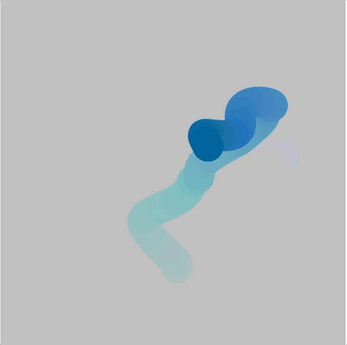

# Bubble
Experimenting with randomly generated coordinates and color matrices using Perlin noise.

Simple JavaScript project that can be run using the execution environement p5js.

# Terrain
Experimenting with randomly generated coordinates and color matrices using Perlin noise.

Simple Java project that can be run using the execution environement Processing.

